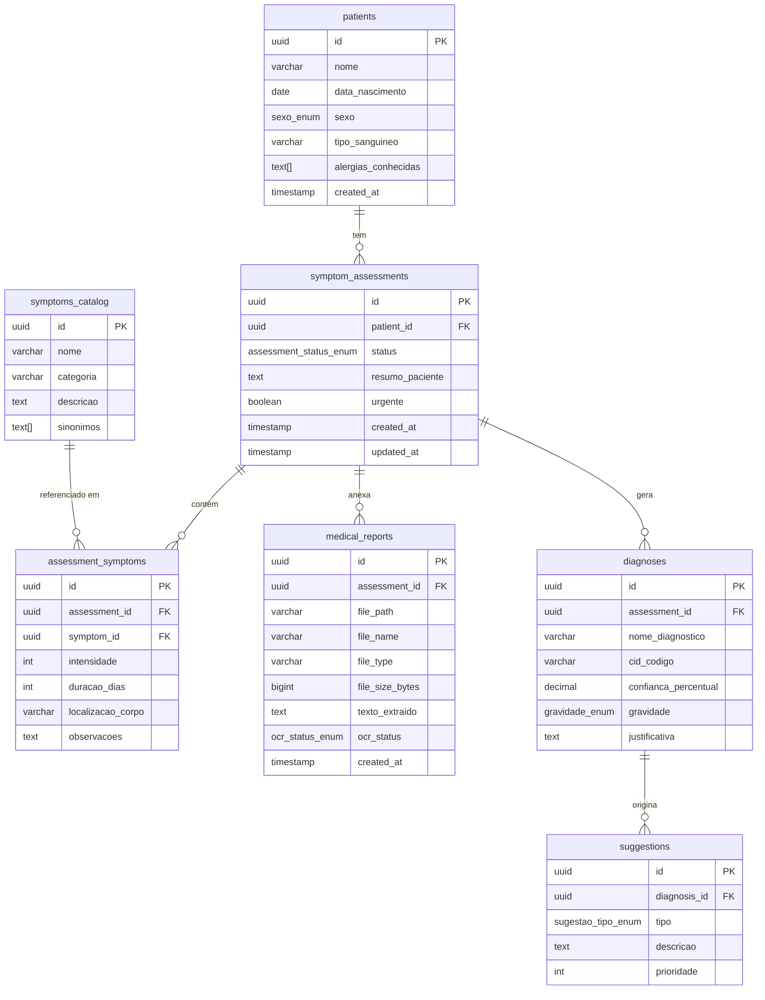

# Data Model: Análise de Sintomas e Diagnóstico Assistido por IA

**Feature**: `specs/001-health-symptom-analysis`
**Data**: 2026-04-17

---

## Diagrama de Entidades



---

## Migrations Flyway

### V1__create_enums.sql

```sql
CREATE TYPE sexo_enum AS ENUM ('masculino', 'feminino', 'outro', 'nao_informado');

CREATE TYPE assessment_status_enum AS ENUM ('rascunho', 'processando', 'concluido', 'erro');

CREATE TYPE ocr_status_enum AS ENUM ('pendente', 'processado', 'erro');

CREATE TYPE gravidade_enum AS ENUM ('baixa', 'media', 'alta', 'critica');

CREATE TYPE sugestao_tipo_enum AS ENUM ('especialista', 'exame', 'habito', 'urgencia');
```

### V2__create_patients.sql

```sql
CREATE TABLE patients (
    id              UUID PRIMARY KEY DEFAULT gen_random_uuid(),
    nome            VARCHAR(255) NOT NULL,
    data_nascimento DATE,
    sexo            sexo_enum NOT NULL DEFAULT 'nao_informado',
    tipo_sanguineo  VARCHAR(5),
    alergias_conhecidas TEXT[] NOT NULL DEFAULT '{}',
    created_at      TIMESTAMP WITH TIME ZONE NOT NULL DEFAULT NOW(),

    CONSTRAINT chk_tipo_sanguineo CHECK (
        tipo_sanguineo IS NULL OR tipo_sanguineo IN ('A+','A-','B+','B-','AB+','AB-','O+','O-')
    )
);

CREATE INDEX idx_patients_nome ON patients(nome);
```

### V3__create_symptoms_catalog.sql

```sql
CREATE TABLE symptoms_catalog (
    id          UUID PRIMARY KEY DEFAULT gen_random_uuid(),
    nome        VARCHAR(255) NOT NULL,
    categoria   VARCHAR(100) NOT NULL,
    descricao   TEXT,
    sinonimos   TEXT[] NOT NULL DEFAULT '{}',

    CONSTRAINT uq_symptoms_catalog_nome UNIQUE (nome)
);

CREATE INDEX idx_symptoms_catalog_categoria ON symptoms_catalog(categoria);
CREATE INDEX idx_symptoms_catalog_nome_trgm ON symptoms_catalog USING gin(nome gin_trgm_ops);
```

> **Nota**: O índice `gin_trgm_ops` requer a extensão `pg_trgm` (habilitada na V1 ou como prerequisite). Para busca por autocomplete no backend, usar `ILIKE '%termo%'` é suficiente sem a extensão se o catálogo for pequeno (< 500 itens).

### V4__create_assessments.sql

```sql
CREATE TABLE symptom_assessments (
    id              UUID PRIMARY KEY DEFAULT gen_random_uuid(),
    patient_id      UUID NOT NULL REFERENCES patients(id) ON DELETE CASCADE,
    status          assessment_status_enum NOT NULL DEFAULT 'rascunho',
    resumo_paciente TEXT,
    urgente         BOOLEAN NOT NULL DEFAULT FALSE,
    created_at      TIMESTAMP WITH TIME ZONE NOT NULL DEFAULT NOW(),
    updated_at      TIMESTAMP WITH TIME ZONE NOT NULL DEFAULT NOW()
);

CREATE INDEX idx_assessments_patient_id ON symptom_assessments(patient_id);
CREATE INDEX idx_assessments_status ON symptom_assessments(status);
CREATE INDEX idx_assessments_created_at ON symptom_assessments(created_at DESC);
```

### V5__create_assessment_symptoms.sql

```sql
CREATE TABLE assessment_symptoms (
    id              UUID PRIMARY KEY DEFAULT gen_random_uuid(),
    assessment_id   UUID NOT NULL REFERENCES symptom_assessments(id) ON DELETE CASCADE,
    symptom_id      UUID REFERENCES symptoms_catalog(id) ON DELETE SET NULL,
    intensidade     INT NOT NULL,
    duracao_dias    INT,
    localizacao_corpo VARCHAR(100),
    observacoes     TEXT,

    CONSTRAINT chk_intensidade CHECK (intensidade BETWEEN 1 AND 10),
    CONSTRAINT chk_duracao CHECK (duracao_dias IS NULL OR duracao_dias >= 0)
);

CREATE INDEX idx_assessment_symptoms_assessment ON assessment_symptoms(assessment_id);
```

### V6__create_medical_reports.sql

```sql
CREATE TABLE medical_reports (
    id              UUID PRIMARY KEY DEFAULT gen_random_uuid(),
    assessment_id   UUID NOT NULL REFERENCES symptom_assessments(id) ON DELETE CASCADE,
    file_path       VARCHAR(500) NOT NULL,
    file_name       VARCHAR(255) NOT NULL,
    file_type       VARCHAR(50) NOT NULL,
    file_size_bytes BIGINT NOT NULL,
    texto_extraido  TEXT,
    ocr_status      ocr_status_enum NOT NULL DEFAULT 'pendente',
    created_at      TIMESTAMP WITH TIME ZONE NOT NULL DEFAULT NOW(),

    CONSTRAINT chk_file_size CHECK (file_size_bytes > 0 AND file_size_bytes <= 10485760),
    CONSTRAINT chk_file_type CHECK (file_type IN ('image/jpeg', 'image/png', 'application/pdf'))
);

CREATE INDEX idx_medical_reports_assessment ON medical_reports(assessment_id);
```

### V7__create_diagnoses.sql

```sql
CREATE TABLE diagnoses (
    id                  UUID PRIMARY KEY DEFAULT gen_random_uuid(),
    assessment_id       UUID NOT NULL REFERENCES symptom_assessments(id) ON DELETE CASCADE,
    nome_diagnostico    VARCHAR(500) NOT NULL,
    cid_codigo          VARCHAR(20),
    confianca_percentual DECIMAL(5,2),
    gravidade           gravidade_enum NOT NULL,
    justificativa       TEXT,

    CONSTRAINT chk_confianca CHECK (
        confianca_percentual IS NULL OR
        confianca_percentual BETWEEN 0.0 AND 100.0
    )
);

CREATE INDEX idx_diagnoses_assessment ON diagnoses(assessment_id);
CREATE INDEX idx_diagnoses_gravidade ON diagnoses(gravidade);
```

### V8__create_suggestions.sql

```sql
CREATE TABLE suggestions (
    id              UUID PRIMARY KEY DEFAULT gen_random_uuid(),
    diagnosis_id    UUID NOT NULL REFERENCES diagnoses(id) ON DELETE CASCADE,
    tipo            sugestao_tipo_enum NOT NULL,
    descricao       TEXT NOT NULL,
    prioridade      INT NOT NULL DEFAULT 3,

    CONSTRAINT chk_prioridade CHECK (prioridade BETWEEN 1 AND 5)
);

CREATE INDEX idx_suggestions_diagnosis ON suggestions(diagnosis_id);
CREATE INDEX idx_suggestions_tipo ON suggestions(tipo);
```

### V9__seed_symptoms_catalog.sql

```sql
INSERT INTO symptoms_catalog (nome, categoria, descricao, sinonimos) VALUES
-- Dor
('Dor de cabeça', 'Neurológico', 'Dor ou desconforto na região da cabeça ou pescoço', ARRAY['cefaleia', 'enxaqueca', 'migrânea']),
('Dor no peito', 'Cardíaco/Respiratório', 'Dor, pressão ou desconforto na região torácica', ARRAY['dor torácica', 'aperto no peito']),
('Dor abdominal', 'Gastrointestinal', 'Dor ou cólica na região do abdômen', ARRAY['dor de barriga', 'cólica', 'dor estomacal']),
('Dor nas costas', 'Musculoesquelético', 'Dor na região lombar, dorsal ou cervical', ARRAY['lombalgia', 'dor lombar', 'dor cervical']),
('Dor muscular', 'Musculoesquelético', 'Dor ou tensão nos músculos', ARRAY['mialgia', 'dor muscular', 'tensão muscular']),
-- Respiratório
('Falta de ar', 'Respiratório', 'Dificuldade para respirar ou sensação de sufocamento', ARRAY['dispneia', 'dificuldade respiratória', 'fôlego curto']),
('Tosse', 'Respiratório', 'Tosse seca ou produtiva', ARRAY['tosse seca', 'tosse com catarro', 'tosse persistente']),
('Coriza', 'Respiratório', 'Secreção nasal', ARRAY['rinorreia', 'nariz escorrendo', 'secreção nasal']),
-- Sistêmico
('Febre', 'Sistêmico', 'Temperatura corporal elevada (> 37,5°C)', ARRAY['temperatura alta', 'hipertermia']),
('Fadiga', 'Sistêmico', 'Cansaço extremo ou falta de energia', ARRAY['cansaço', 'fraqueza', 'astenia']),
('Tontura', 'Neurológico', 'Sensação de instabilidade ou vertigem', ARRAY['vertigem', 'labirintite', 'desequilíbrio']),
-- Gastrointestinal
('Náusea', 'Gastrointestinal', 'Sensação de enjoo', ARRAY['enjoo', 'mal-estar gástrico']),
('Vômito', 'Gastrointestinal', 'Expulsão do conteúdo gástrico', ARRAY['vomitar', 'ânsia de vômito']),
('Diarreia', 'Gastrointestinal', 'Evacuações frequentes e líquidas', ARRAY['desarranjo intestinal', 'fezes líquidas']),
-- Pele
('Erupção cutânea', 'Dermatológico', 'Manchas, vermelhidão ou lesões na pele', ARRAY['rash', 'alergia na pele', 'urticária']),
('Coceira', 'Dermatológico', 'Sensação de prurido na pele', ARRAY['prurido', 'irritação cutânea'])
ON CONFLICT (nome) DO NOTHING;
```

---

## Regras de Negócio e Transições de Estado

### `symptom_assessments.status`

```
rascunho ──► processando ──► concluido
                         └──► erro
```

- **rascunho**: avaliação criada, sintomas sendo adicionados, arquivos sendo upados.
- **processando**: `POST /submit` foi chamado, request enviada ao Gemini.
- **concluido**: resposta do Gemini parseada e diagnósticos/sugestões salvos.
- **erro**: falha na comunicação com Gemini após 1 retry, ou parse inválido do JSON.

### `medical_reports.ocr_status`

- **pendente**: arquivo salvo, ainda não enviado ao Gemini.
- **processado**: conteúdo do arquivo incluído na análise com sucesso.
- **erro**: arquivo corrompido ou formato inválido (mesmo assim a avaliação prossegue).

---

## Migrations SQLite (substituem V1–V9 originais)

> Adicionado em 2026-04-23. As migrations abaixo substituem completamente as migrations PostgreSQL.
> Diferenças-chave: sem `CREATE TYPE`, UUID como TEXT, arrays como JSON, `INSERT OR IGNORE INTO`.

### V1__create_enums.sql (no-op)

```sql
-- SQLite: enums handled as TEXT CHECK constraints inline in each table
SELECT 1;
```

### V2__create_patients.sql

```sql
CREATE TABLE patients (
    id                  TEXT PRIMARY KEY,
    nome                TEXT NOT NULL,
    data_nascimento     TEXT,
    sexo                TEXT NOT NULL DEFAULT 'nao_informado'
                            CHECK (sexo IN ('masculino','feminino','outro','nao_informado')),
    tipo_sanguineo      TEXT
                            CHECK (tipo_sanguineo IS NULL OR
                                   tipo_sanguineo IN ('A+','A-','B+','B-','AB+','AB-','O+','O-')),
    alergias_conhecidas TEXT NOT NULL DEFAULT '[]',
    created_at          TEXT NOT NULL DEFAULT (strftime('%Y-%m-%dT%H:%M:%SZ', 'now'))
);

CREATE INDEX idx_patients_nome ON patients(nome);
```

### V3__create_symptoms_catalog.sql

```sql
CREATE TABLE symptoms_catalog (
    id        TEXT PRIMARY KEY,
    nome      TEXT NOT NULL,
    categoria TEXT NOT NULL,
    descricao TEXT,
    sinonimos TEXT NOT NULL DEFAULT '[]',

    CONSTRAINT uq_symptoms_catalog_nome UNIQUE (nome)
);

CREATE INDEX idx_symptoms_catalog_categoria ON symptoms_catalog(categoria);
```

### V4__create_assessments.sql

```sql
CREATE TABLE symptom_assessments (
    id              TEXT PRIMARY KEY,
    patient_id      TEXT NOT NULL REFERENCES patients(id) ON DELETE CASCADE,
    status          TEXT NOT NULL DEFAULT 'rascunho'
                        CHECK (status IN ('rascunho','processando','concluido','erro')),
    resumo_paciente TEXT,
    urgente         INTEGER NOT NULL DEFAULT 0,
    created_at      TEXT NOT NULL DEFAULT (strftime('%Y-%m-%dT%H:%M:%SZ', 'now')),
    updated_at      TEXT NOT NULL DEFAULT (strftime('%Y-%m-%dT%H:%M:%SZ', 'now'))
);

CREATE INDEX idx_assessments_patient_id ON symptom_assessments(patient_id);
CREATE INDEX idx_assessments_status     ON symptom_assessments(status);
CREATE INDEX idx_assessments_created_at ON symptom_assessments(created_at DESC);
```

### V5__create_assessment_symptoms.sql

```sql
CREATE TABLE assessment_symptoms (
    id                TEXT PRIMARY KEY,
    assessment_id     TEXT NOT NULL REFERENCES symptom_assessments(id) ON DELETE CASCADE,
    symptom_id        TEXT REFERENCES symptoms_catalog(id) ON DELETE SET NULL,
    nome_custom       TEXT,
    intensidade       INTEGER NOT NULL CHECK (intensidade BETWEEN 1 AND 10),
    duracao_dias      INTEGER CHECK (duracao_dias IS NULL OR duracao_dias >= 0),
    localizacao_corpo TEXT,
    observacoes       TEXT,
    created_at        TEXT NOT NULL DEFAULT (strftime('%Y-%m-%dT%H:%M:%SZ', 'now'))
);

CREATE INDEX idx_assessment_symptoms_assessment ON assessment_symptoms(assessment_id);
```

### V6__create_medical_reports.sql

```sql
CREATE TABLE medical_reports (
    id              TEXT PRIMARY KEY,
    assessment_id   TEXT NOT NULL REFERENCES symptom_assessments(id) ON DELETE CASCADE,
    file_path       TEXT NOT NULL,
    file_name       TEXT NOT NULL,
    file_type       TEXT NOT NULL
                        CHECK (file_type IN ('image/jpeg','image/png','application/pdf')),
    file_size_bytes INTEGER NOT NULL CHECK (file_size_bytes > 0 AND file_size_bytes <= 10485760),
    texto_extraido  TEXT,
    ocr_status      TEXT NOT NULL DEFAULT 'pendente'
                        CHECK (ocr_status IN ('pendente','processado','erro')),
    created_at      TEXT NOT NULL DEFAULT (strftime('%Y-%m-%dT%H:%M:%SZ', 'now'))
);

CREATE INDEX idx_medical_reports_assessment ON medical_reports(assessment_id);
```

### V7__create_diagnoses.sql

```sql
CREATE TABLE diagnoses (
    id                   TEXT PRIMARY KEY,
    assessment_id        TEXT NOT NULL REFERENCES symptom_assessments(id) ON DELETE CASCADE,
    nome_diagnostico     TEXT NOT NULL,
    cid_codigo           TEXT,
    confianca_percentual REAL CHECK (confianca_percentual IS NULL OR
                                     confianca_percentual BETWEEN 0.0 AND 100.0),
    gravidade            TEXT NOT NULL
                             CHECK (gravidade IN ('baixa','media','alta','critica')),
    justificativa        TEXT,
    created_at           TEXT NOT NULL DEFAULT (strftime('%Y-%m-%dT%H:%M:%SZ', 'now'))
);

CREATE INDEX idx_diagnoses_assessment ON diagnoses(assessment_id);
CREATE INDEX idx_diagnoses_gravidade  ON diagnoses(gravidade);
```

### V8__create_suggestions.sql

```sql
CREATE TABLE suggestions (
    id           TEXT PRIMARY KEY,
    diagnosis_id TEXT NOT NULL REFERENCES diagnoses(id) ON DELETE CASCADE,
    tipo         TEXT NOT NULL
                     CHECK (tipo IN ('especialista','exame','habito','urgencia')),
    descricao    TEXT NOT NULL,
    prioridade   INTEGER NOT NULL DEFAULT 3 CHECK (prioridade BETWEEN 1 AND 5),
    created_at   TEXT NOT NULL DEFAULT (strftime('%Y-%m-%dT%H:%M:%SZ', 'now'))
);

CREATE INDEX idx_suggestions_diagnosis ON suggestions(diagnosis_id);
CREATE INDEX idx_suggestions_tipo      ON suggestions(tipo);
```

### V9__seed_symptoms_catalog.sql

```sql
INSERT OR IGNORE INTO symptoms_catalog (id, nome, categoria, descricao, sinonimos) VALUES
-- Dor
('a1b2c3d4-0001-0000-0000-000000000001','Dor de cabeça','Neurológico','Dor ou desconforto na região da cabeça ou pescoço','["cefaleia","enxaqueca","migrânea"]'),
('a1b2c3d4-0002-0000-0000-000000000002','Dor no peito','Cardíaco/Respiratório','Dor, pressão ou desconforto na região torácica','["dor torácica","aperto no peito"]'),
('a1b2c3d4-0003-0000-0000-000000000003','Dor abdominal','Gastrointestinal','Dor ou cólica na região do abdômen','["dor de barriga","cólica","dor estomacal"]'),
('a1b2c3d4-0004-0000-0000-000000000004','Dor nas costas','Musculoesquelético','Dor na região lombar, dorsal ou cervical','["lombalgia","dor lombar","dor cervical"]'),
('a1b2c3d4-0005-0000-0000-000000000005','Dor muscular','Musculoesquelético','Dor ou tensão nos músculos','["mialgia","dor muscular","tensão muscular"]'),
-- Respiratório
('a1b2c3d4-0006-0000-0000-000000000006','Falta de ar','Respiratório','Dificuldade para respirar ou sensação de sufocamento','["dispneia","dificuldade respiratória","fôlego curto"]'),
('a1b2c3d4-0007-0000-0000-000000000007','Tosse','Respiratório','Tosse seca ou produtiva','["tosse seca","tosse com catarro","tosse persistente"]'),
('a1b2c3d4-0008-0000-0000-000000000008','Coriza','Respiratório','Secreção nasal','["rinorreia","nariz escorrendo","secreção nasal"]'),
-- Sistêmico
('a1b2c3d4-0009-0000-0000-000000000009','Febre','Sistêmico','Temperatura corporal elevada (> 37,5°C)','["temperatura alta","hipertermia"]'),
('a1b2c3d4-0010-0000-0000-000000000010','Fadiga','Sistêmico','Cansaço extremo ou falta de energia','["cansaço","fraqueza","astenia"]'),
('a1b2c3d4-0011-0000-0000-000000000011','Tontura','Neurológico','Sensação de instabilidade ou vertigem','["vertigem","labirintite","desequilíbrio"]'),
-- Gastrointestinal
('a1b2c3d4-0012-0000-0000-000000000012','Náusea','Gastrointestinal','Sensação de enjoo','["enjoo","mal-estar gástrico"]'),
('a1b2c3d4-0013-0000-0000-000000000013','Vômito','Gastrointestinal','Expulsão do conteúdo gástrico','["vomitar","ânsia de vômito"]'),
('a1b2c3d4-0014-0000-0000-000000000014','Diarreia','Gastrointestinal','Evacuações frequentes e líquidas','["desarranjo intestinal","fezes líquidas"]'),
-- Pele
('a1b2c3d4-0015-0000-0000-000000000015','Erupção cutânea','Dermatológico','Manchas, vermelhidão ou lesões na pele','["rash","alergia na pele","urticária"]'),
('a1b2c3d4-0016-0000-0000-000000000016','Coceira','Dermatológico','Sensação de prurido na pele','["prurido","irritação cutânea"]');
```
