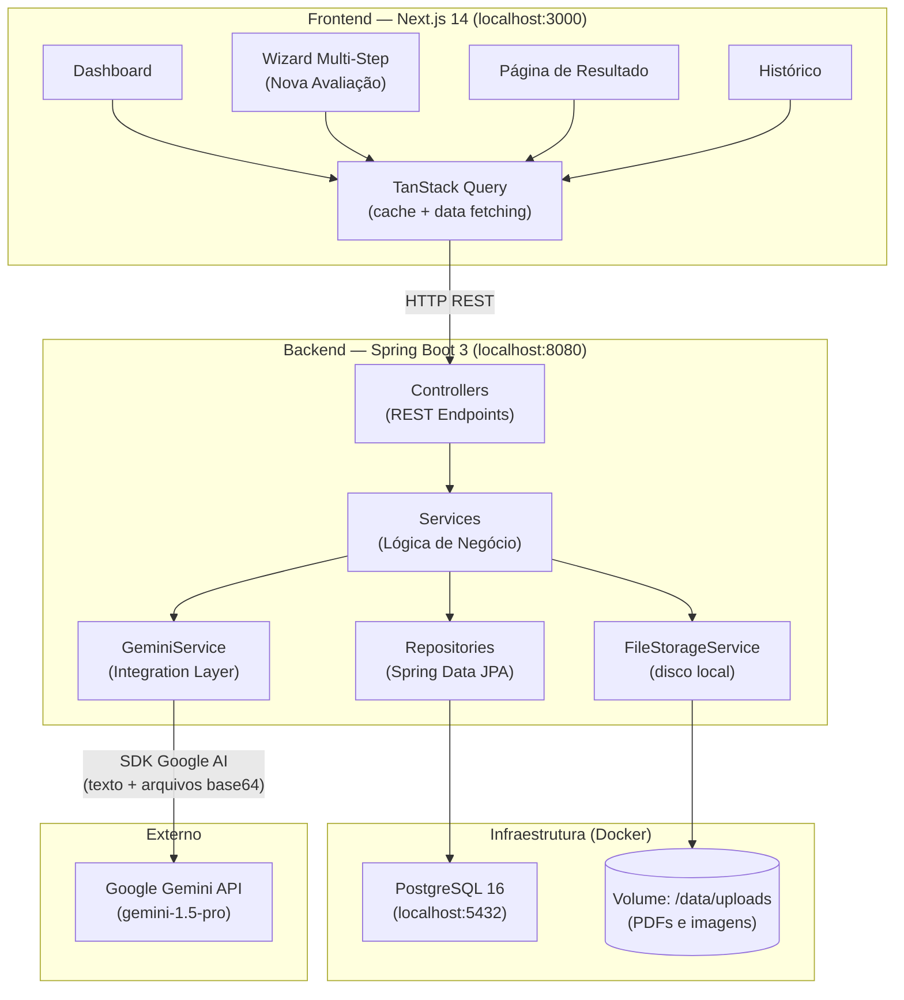
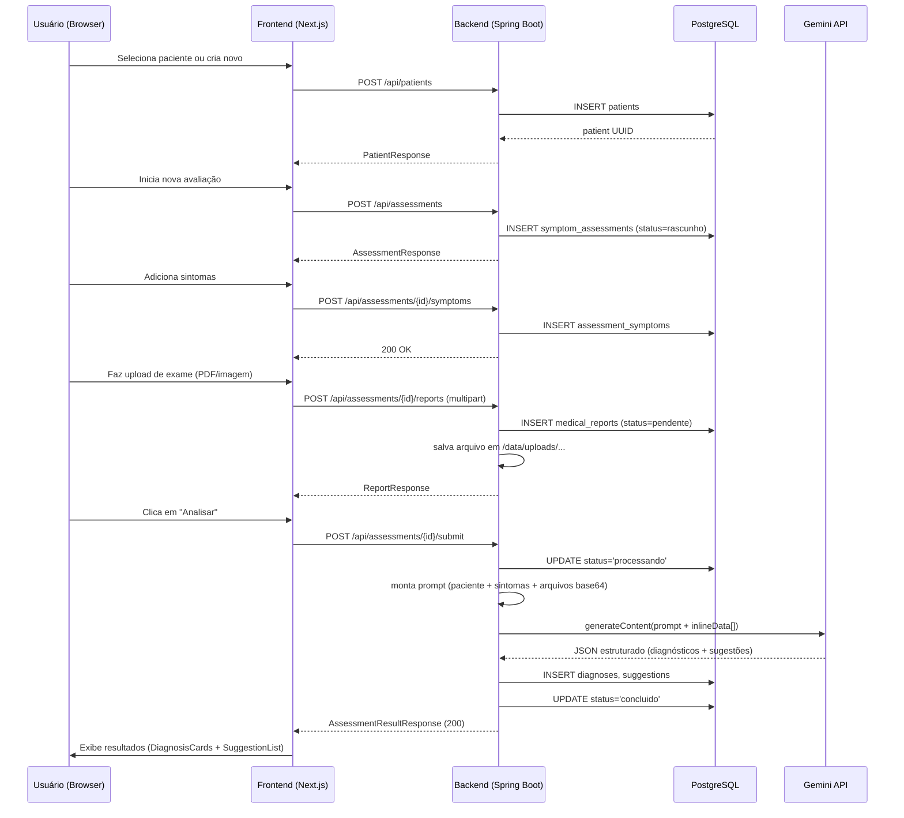

# Plano de Implementação: DoutorIA

**Feature**: `specs/001-health-symptom-analysis`
**Data**: 2026-04-17
**Stack**: Next.js 14 + Java 21/Spring Boot 3 + PostgreSQL + Gemini API
**Ambiente**: Local (Docker Compose)

---

## Diagrama de Arquitetura



---

## Fluxo Principal (Sequência)



---

## Fases de Implementação

### Fase 1 — Infraestrutura e Backend Base (2–3 dias)

**Objetivos**: banco funcionando, endpoints CRUD, sem integração Gemini.

| Tarefa | Descrição |
|---|---|
| 1.1 | Criar projeto Spring Boot via Spring Initializr (web, jpa, validation, flyway, postgresql, lombok) |
| 1.2 | Configurar `docker-compose.yml` com PostgreSQL |
| 1.3 | Criar migrations Flyway V1–V9 (schema + seed) |
| 1.4 | Criar entities JPA (`Patient`, `SymptomAssessment`, `AssessmentSymptom`, `MedicalReport`, `Diagnosis`, `Suggestion`, `SymptomsCatalog`) |
| 1.5 | Criar repositories Spring Data JPA |
| 1.6 | Criar DTOs de request/response + MapStruct mappers |
| 1.7 | Implementar `PatientController` + `PatientService` (CRUD) |
| 1.8 | Implementar `AssessmentController` + `AssessmentService` (criar, adicionar sintomas) |
| 1.9 | Implementar `FileStorageService` (salvar arquivo em disco local) |
| 1.10 | Implementar endpoint de upload (`POST /assessments/{id}/reports`) |
| 1.11 | Implementar `SymptomsController` (busca no catálogo) |
| 1.12 | Configurar CORS (`localhost:3000`) e `application.yml` |

**Critério de conclusão**: `POST /api/patients` e `GET /api/symptoms?q=dor` retornam 200 com dados.

---

### Fase 2 — Integração com Gemini (1–2 dias)

**Objetivos**: análise real funcionando end-to-end.

| Tarefa | Descrição |
|---|---|
| 2.1 | Adicionar dependência `com.google.ai.client.generativeai:generativeai` |
| 2.2 | Criar `GeminiConfig` (bean do `GenerativeModel` com API key) |
| 2.3 | Criar `GeminiService.analyze(AssessmentContext context)` |
| 2.4 | Montar `SystemInstruction` (persona médica + disclaimer + JSON obrigatório) |
| 2.5 | Montar `UserPrompt` dinâmico (paciente + sintomas + relatórios) |
| 2.6 | Converter arquivos para `Part.inlineData` (base64 + mimeType) |
| 2.7 | Configurar `GenerationConfig` (`temperature=0.2`, `responseMimeType=application/json`) |
| 2.8 | Parsear resposta JSON → `GeminiResponse` POJO (Jackson) |
| 2.9 | Persistir `Diagnosis` + `Suggestion` a partir do `GeminiResponse` |
| 2.10 | Implementar retry simples (1 retry com 2s de espera) |
| 2.11 | Tratamento de erro: marcar assessment como `erro`, logar exceção |
| 2.12 | Implementar `POST /assessments/{id}/submit` completo |
| 2.13 | Testar com avaliação real (sintomas + PDF de exame) |

**Critério de conclusão**: `POST /submit` retorna diagnósticos reais do Gemini com `status=concluido`.

---

### Fase 3 — Frontend Base (3–4 dias)

**Objetivos**: interface funcional conectada ao backend.

| Tarefa | Descrição |
|---|---|
| 3.1 | Criar projeto Next.js 14 com TypeScript + Tailwind + shadcn/ui |
| 3.2 | Configurar TanStack Query (`QueryClientProvider`) + `axios` |
| 3.3 | Gerar tipos TypeScript a partir dos contratos (`types/api.ts`) |
| 3.4 | Criar `lib/api.ts` com todas as funções de chamada ao backend |
| 3.5 | Implementar layout raiz + `ThemeProvider` (next-themes, claro/escuro) |
| 3.6 | Criar componente `MedicalDisclaimer` (aviso obrigatório) |
| 3.7 | Implementar Dashboard (lista de pacientes + atalho nova avaliação) |
| 3.8 | Implementar `AssessmentWizard` (4 steps com `react-hook-form` + Zod) |
| 3.9 | Implementar `SymptomSearch` (autocomplete com debounce 300ms) |
| 3.10 | Implementar `IntensitySlider` (shadcn/ui Slider, 1–10) |
| 3.11 | Implementar `BodyLocationSelect` (Select com regiões pré-definidas) |
| 3.12 | Implementar `FileUploader` (react-dropzone, preview PDF/imagem) |
| 3.13 | Implementar tela de loading/polling durante análise |
| 3.14 | Implementar `DiagnosisCard` (badge de gravidade colorido) |
| 3.15 | Implementar `SuggestionList` (agrupado por tipo com ícones) |
| 3.16 | Implementar `UrgencyBanner` (alerta vermelho se `urgente=true`) |
| 3.17 | Implementar página de Resultado completa |
| 3.18 | Implementar página de Histórico com filtros |

**Critério de conclusão**: fluxo completo funciona no browser (criar paciente → avaliação → upload → submeter → ver resultado).

---

### Fase 4 — Polimento e Docker (1 dia)

| Tarefa | Descrição |
|---|---|
| 4.1 | Criar `Dockerfile` do backend (multi-stage: build + runtime `eclipse-temurin:21-jre`) |
| 4.2 | Testar `docker compose up --build` end-to-end |
| 4.3 | Adicionar skeletons de loading no frontend |
| 4.4 | Testar modo escuro em todas as páginas |
| 4.5 | Revisar labels e mensagens de erro no formulário |
| 4.6 | Criar `.env.example` |
| 4.7 | Verificar aviso médico em todas as telas de resultado |

---

## Prompt Engineering do Gemini

### System Instruction

```
Você é um assistente médico analítico de triagem. Seu papel é analisar sintomas e documentos médicos e fornecer uma avaliação preliminar informativa.

REGRAS OBRIGATÓRIAS:
1. Responda SEMPRE em JSON válido seguindo exatamente o schema fornecido.
2. Nunca prescreva medicamentos controlados ou indique dosagens.
3. Sempre use linguagem de probabilidade ("pode indicar", "sugere possibilidade de"), nunca afirmações definitivas.
4. Inclua no campo "resumo_geral" o aviso: "Esta análise é informativa e NÃO substitui consulta médica presencial."
5. O campo "urgente" deve ser true apenas se houver risco real à vida (dor torácica com irradiação, AVC suspeito, dificuldade respiratória grave, etc.).
6. Responda em português brasileiro.
```

### User Prompt Template

```
DADOS DO PACIENTE:
- Nome: {nome}
- Idade: {idade} anos
- Sexo: {sexo}
- Tipo sanguíneo: {tipoSanguineo}
- Alergias conhecidas: {alergias}

SINTOMAS RELATADOS:
{foreach sintoma}
- {sintoma.nome}: intensidade {sintoma.intensidade}/10, duração {sintoma.duracaoDias} dias, localização: {sintoma.localizacao}
  Observações: {sintoma.observacoes}
{end}

{if relatorios}
DOCUMENTOS MÉDICOS ANEXADOS: {count} arquivo(s)
Analise os documentos em conjunto com os sintomas acima.
{end}

Com base nessas informações, forneça sua análise seguindo o JSON schema definido.
```

### Schema JSON de Resposta

```json
{
  "type": "object",
  "properties": {
    "diagnosticos": {
      "type": "array",
      "items": {
        "type": "object",
        "properties": {
          "nome": { "type": "string" },
          "cid": { "type": "string" },
          "confianca": { "type": "number", "minimum": 0, "maximum": 1 },
          "gravidade": { "type": "string", "enum": ["baixa", "media", "alta", "critica"] },
          "justificativa": { "type": "string" }
        },
        "required": ["nome", "confianca", "gravidade", "justificativa"]
      }
    },
    "sugestoes": {
      "type": "array",
      "items": {
        "type": "object",
        "properties": {
          "tipo": { "type": "string", "enum": ["especialista", "exame", "habito", "urgencia"] },
          "descricao": { "type": "string" },
          "prioridade": { "type": "integer", "minimum": 1, "maximum": 5 }
        },
        "required": ["tipo", "descricao", "prioridade"]
      }
    },
    "resumo_geral": { "type": "string" },
    "urgente": { "type": "boolean" }
  },
  "required": ["diagnosticos", "sugestoes", "resumo_geral", "urgente"]
}
```

---

## Interfaces dos Services Principais (Java)

```java
// PatientService
public interface PatientService {
    PatientResponse create(CreatePatientRequest request);
    PatientResponse findById(UUID id);
    List<PatientResponse> findAll();
}

// AssessmentService
public interface AssessmentService {
    AssessmentResponse create(UUID patientId);
    AssessmentResponse addSymptoms(UUID assessmentId, AddSymptomsRequest request);
    ReportResponse addReport(UUID assessmentId, MultipartFile file);
    AssessmentResultResponse submit(UUID assessmentId);
    AssessmentResultResponse getResult(UUID assessmentId);
    Page<AssessmentSummaryResponse> getHistory(UUID patientId, Pageable pageable);
    void delete(UUID assessmentId);
}

// GeminiService
public interface GeminiService {
    GeminiAnalysisResult analyze(AssessmentContext context);
}

// AssessmentContext (record)
public record AssessmentContext(
    PatientDTO patient,
    List<SymptomDTO> symptoms,
    List<ReportFileDTO> reports   // inclui bytes + mimeType para inlineData
) {}

// FileStorageService
public interface FileStorageService {
    String store(UUID assessmentId, MultipartFile file);  // retorna file_path
    byte[] load(String filePath);
    void delete(String filePath);
}

// SymptomsService
public interface SymptomsService {
    List<SymptomCatalogResponse> search(String query, String categoria);
}
```

---

## Componentes Frontend (TypeScript)

```typescript
// SymptomSearch.tsx
interface SymptomSearchProps {
  onSelect: (symptom: SymptomCatalogItem | null) => void;
  placeholder?: string;
}

// IntensitySlider.tsx
interface IntensitySliderProps {
  value: number;
  onChange: (value: number) => void;
  label?: string;
}

// FileUploader.tsx
interface FileUploaderProps {
  onFilesChange: (files: File[]) => void;
  maxFiles?: number;   // default: 5
  maxSizeMB?: number;  // default: 10
  accept?: string[];   // default: ['image/jpeg', 'image/png', 'application/pdf']
}

// DiagnosisCard.tsx
interface DiagnosisCardProps {
  diagnosis: DiagnosisResponse;
  suggestions: SuggestionResponse[];
}

// MedicalDisclaimer.tsx — sem props, sempre visível acima do resultado
```

---

## Riscos Técnicos e Mitigações

| Risco | Probabilidade | Impacto | Mitigação |
|---|---|---|---|
| SDK Gemini Java desatualizado ou com API diferente | Média | Alto | Testar integração primeiro (Fase 2 pode antecipar para validar antes do frontend) |
| PDFs com layout complexo (tabelas, gráficos) | Alta | Médio | Gemini 1.5 Pro lida bem; documentar limitação no README |
| Timeout no `submit` (análise > 30s) | Baixa para uso local | Médio | Implementar fallback polling (202 + GET polling) |
| Problemas de CORS no desenvolvimento | Baixa | Baixo | `CorsConfiguration` liberada para `localhost:3000` já planejada |
| Resposta JSON malformada do Gemini | Baixa | Alto | Retry 1x + try/catch no parse + marcar assessment como `erro` com mensagem |
